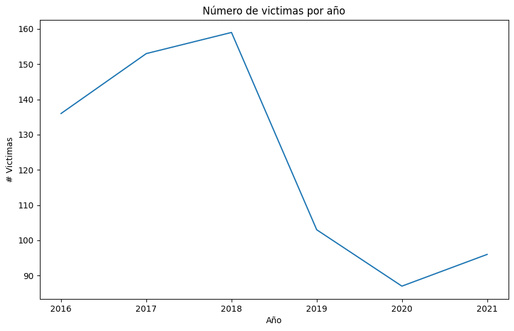

 

<h1 align= 'center'>PROYECTO INDIVIDUAL N° 2</h1>
<h1 align ='center'>SINIESTROS VIALES</h1>

  

<h1 align='left'>INTRODUCCIÓN</h1>

Los siniestros viales, también conocidos como accidentes viales, de tránsito o tráfico, son sucesos que ocurren por lo general cuando un vehiculo colisiona contra uno o más sectores de la vialidad (estos pueden ser otro vehículo, una persona,animal o escombros del camino) u otra obstruccion estacionaria como un poste, edificio o árbol, etc.

Estos no son aleatorios y usualmente están acomáñados por corresponsabilidades cómo pueden ser ajenas o propias del conductor o conductora.
En este informe se pretende generar la información que permita a las autoridades locales tomar medidas para disminuir la cantidad de víctimas fatales de los siniestros viales.

La seguridad vial es una problemática a nivel mundial, en Argentina, la inseguridad vial supera las 10 vícimas fatales por cada 100 mil habitantes, la inseguridaad vial es una de las principales causas de muerte por enfermedades no transmisibles entre los menores de 35 años (Dirección Nacional de Observatorio Vial, 2023).

En Argentina, cada año mueren cerca de 4.000 personas en siniestros viales. Aunque muchas jurisdicciones han logrado disminuir la cantidad de accidentes de tránsito, esta sigue siendo la principal causa de muertes violentas en el país. Los informes del Sistema Nacional de Información Criminal (SNIC), del Ministerio de Seguridad de la Nación, revelan que entre 2018 y 2022 se registraron 19.630 muertes en siniestros viales en todo el país. Estas cifras equivalen a 11 personas por día que resultaron víctimas fatales por accidentes de tránsito.

Solo en 2022, se contabilizaron 3.828 muertes fatales en este tipo de hechos. Los expertos en la materia indican que en Argentina es dos o tres veces más alta la probabilidad de que una persona muera en un siniestro vial que en un hecho de inseguridad delictiva.

Debido a esto es que se tiene como objetivo generar información para proveer a las autoridads locales las medidas adecuadas para disminuir la cantidad de víctimas fatales de los siniestros viales

<h1 align='left'>ETL</h1>

Para realizar el proceso de Extracción, transformacion y carga de los datos, se obtuvo el dataset 'homicidios.xlsx' con 4 solapas, se decidió utilizar las hojas con el nombre de 'HECHOS' y 'VICTIMAS' ya que estas contenian los datos a utilizar, uan vez que se convirtieron a un data frame se procedió a realizar un 'merge' de los dos dataframe por medio de la columna en común 'ID', posterior a eso capitalizamos todos los datos que poseen nuestras columnas con esto volvemos la primer letra en mayusculas y las demás en minúsculas, eliminamos columnas duplicadas e irrelevantes, también se agrego una columna en la que se mostrara el semestre correspondiente del año.

<b>Nulos</b>

Los datos nulos que se encontraron en el DF estaban representados por 'Sd' o 'SD' el cual hace referencia a 'SinDato',se decidió eliminar las filas que tuvieran 'Sd' en las columnas 'VICTIMAS' 'ACUSADO' y 'PARTICIPANTES', se encontraron accidentes pero no había personas encontradas.Para los 'SinDato' encontrados en la columna de 'EDAD' se decidió realizar un 'fillna' con la media de las edades en dicha columna, al igual que para 'HORA_SINIESTRO'

<b>Duplicados</b>

Se encontraron algunos duplicados en la columna 'ID' después de eliminar el año al inicio del ID, así que se decidió reemplazar los duplicados por valores 'NaN' y posterior a eso llenarlos con el indice en el que se encontraban

<b>Outliers</b>

Durante el EDA no se encontraron outliers, pero considerando que había víctimas conduciendo que tenían más de 65 años se puede considerar cómo un valor atípico, ya que consultando la pagina de la Agencia Nacional de Seguridad Vial la vigencia de la licencia disminuye con forme a la edad y la clase de licencia.

<h1 align= 'left'><b>EDA</b></h1>

Una vez que se realizó el ETL del dataset 'Homicidios.xlsx, se procedió a llevar a cabo el EDA, en la cual tenemos una visión gráfica de los datos y se puede realizar un análisis de estos.

<h1 align= 'left'><b>Número de víctimas por año</b></h1>

